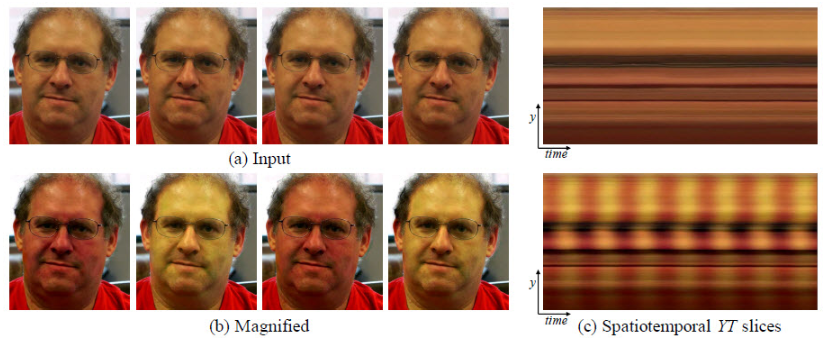

### Análise de Batimento Cardíaco Utilizando Magnificação de Vídeo Euleriano e Detecção Facial

A proposta desse projeto de finalização de disciplina é conseguir detectar batimentos cardíacos utilizando apenas visão computacional. Para esse fim, vamos explorar uma técnica chamada Magnificação de Vídeo Euleriano (*Eulerian Video Magnification*). Esse método de processamento de vídeo foi desenvolvido para amplificar variações sutis de cor e movimento que normalmente não seriam perceptíveis a olho nu. Essa técnica é frequentemente usada em aplicações de visão computacional e processamento de imagem para analisar mudanças dinâmicas em vídeos, como variações no fluxo sanguíneo na pele, movimentos respiratórios ou outros sinais fisiológicos.


> Um exemplo de uso da aplicação de Magnificação de Vídeo Euleriano para visualizar o pulso humano. (a) Quatro frames da sequência de vídeo original. (b) Os mesmos quatro frames com o sinal de pulso do usuário amplificado. (c) Uma linha de varredura vertical dos vídeos de entrada (topo) e saída (parte inferior) plotada ao longo do tempo mostra como nosso método amplifica a variação cromática periódica. Na sequência de entrada, o sinal é imperceptível, mas na sequência ampliada a variação fica clara.

### Escopo da Aplicação

O método de Magnificação de Vídeo Euleriano foi utilizado para inferir o batimento cardíaco através da região facial. Esse processo envolveu a amplificação de variações sutis na coloração da pele da face, que estão associadas aos batimentos cardíacos, tornando essas variações visíveis e analisáveis no vídeo. 

Para realizar esse procedimento, utilizei um algoritmo de detecção facial para identificar e delimitar a região do rosto na imagem. Em seguida, por meio do mapeamento de pontos faciais, identifiquei pontos específicos na testa e nas bochechas para extrair regiões de interesse. Essas regiões foram então analisadas usando a técnica de Magnificação de Vídeo Euleriano para amplificar variações sutis associadas ao batimento cardíaco, permitindo a inferência do pulso a partir das mudanças de cor nessas áreas do rosto.

1. **Inicialização da Classe `BPMFourier`**:
   - Classe chamada `BPMFourier` que é inicializada com a largura (`width`) e altura (`height`) da imagem de entrada.

2. **Inicialização dos Parâmetros**:
   - No construtor (`__init__`), é definido os parâmetros necessários para o processamento do vídeo:
     - `width` e `height`: Dimensões da imagem de entrada.
     - `videoFrameRate`: Taxa de quadros por segundo (FPS) do vídeo.
     - `levels`: Quantidade de níveis na pirâmide gaussiana.
     - `alpha`: Fator de amplificação da imagem filtrada.
     - `minFrequency` e `maxFrequency`: Frequências mínima e máxima para o filtro passa-banda.
     - `bufferSize`: Tamanho do buffer para armazenamento dos quadros processados ao longo do tempo.

3. **Construção da Pirâmide Gaussiana** (`buildGauss`):
   - O método `buildGauss` é usado para construir uma pirâmide gaussiana a partir de um quadro de imagem. Ele reduz iterativamente o tamanho do quadro usando a operação de pirâmide gaussiana (`cv2.pyrDown`) e armazena os níveis da pirâmide em uma lista.

4. **Reconstrução do Quadro** (`reconstructFrame`):
   - O método `reconstructFrame` reconstrói um quadro de imagem a partir de uma pirâmide gaussiana. Ele aplica a operação de pirâmide gaussiana inversa (`cv2.pyrUp`) para reconstruir o quadro original a partir dos níveis da pirâmide.

5. **Atualização do Processamento do Vídeo** (`update`):
   - O método `update` é chamado para processar um novo quadro de imagem.
     - Constrói a pirâmide gaussiana a partir do quadro atual e armazena o nível desejado na lista de vídeo gaussiano.
     - Aplica a transformada de Fourier ao vídeo gaussiano ao longo do tempo para analisar as variações de frequência.
     - Aplica um filtro passa-banda à transformada de Fourier para filtrar frequências específicas associadas ao batimento cardíaco.
     - Calcula o BPM (batimentos por minuto) com base na frequência dominante da transformada de Fourier.
     - Amplifica o sinal filtrado usando o parâmetro `alpha`.
     - Reconstrói o quadro resultante combinando o quadro original com o sinal filtrado.
     - Retorna o quadro resultante e o valor do BPM calculado.

6. **Utilização da Classe**:
   - Após a inicialização da classe `BPMFourier` com as dimensões da imagem de entrada, é aplicado o método `update` a cada quadro de vídeo para obter o quadro processado e o valor do BPM associado à região facial.

7. **Ferramentas Auxiliares**:
    - As funções em `face_utils` fornecem toda a solução para detecção facial e extração de regiões de análise de interesse.
    - As funções em `utils` contém recursos que auxiliam a deixar o display mais performático.

### Citação do Artigo de Referência

* [Eulerian Video Magnification for Revealing Subtle Changes in the World](https://people.csail.mit.edu/mrub/evm/)

```
@article{Wu12Eulerian,
  author = {Hao-Yu Wu and Michael Rubinstein and Eugene Shih and John Guttag and Fr\'{e}do Durand and
  William T. Freeman},
  title = {Eulerian Video Magnification for Revealing Subtle Changes in the World},
  journal = {ACM Transactions on Graphics (Proc. SIGGRAPH 2012)},
  year = {2012},
  volume = {31},
  number = {4},
}
```